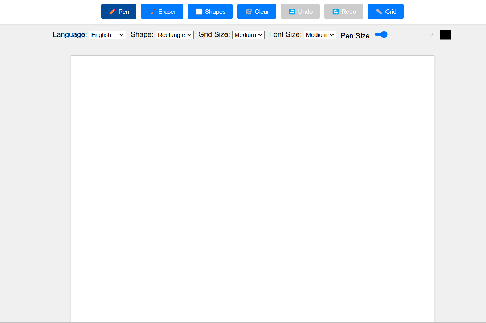

# 🖌️ Enhanced AI Smart Whiteboard


A powerful interactive whiteboard with real-time AI-powered handwriting recognition that works across multiple languages and even understands mathematical notation.



## ✨ Features

- **Real-time handwriting recognition** powered by EasyOCR
- **Multi-language support** including English, Chinese, Japanese, Korean, and more
- **Mathematical expression recognition** with automatic parsing and calculation
- **Smart image preprocessing** with angle correction and noise reduction
- **Drawing tools**: pen, eraser, and various shapes (rectangles, circles, triangles, lines, arrows)
- **Customizable grid** for precise drawing
- **Undo/Redo functionality** for easy editing
- **Responsive design** that works on various screen sizes

## 🚀 Quick Start

### Prerequisites

- Python 3.8+
- Node.js (optional, for development)

### Installation

1. Clone the repository:
   ```bash
   git clone https://github.com/pheonix-19/AI-WhiteBoard.git
   cd AI-WhiteBoard
   ```

2. Install Python dependencies:
   ```bash
   pip install -r requirements.txt
   ```

3. Start the Flask server:
   ```bash
   python server.py
   ```

4. Open `index.html` in your browser or serve it using a simple HTTP server:
   ```bash
   python -m http.server 8000
   ```

5. Navigate to `http://localhost:8000` in your browser.

## 🧠 How It Works

The AI Whiteboard combines a responsive HTML5 canvas-based frontend with a powerful Flask backend:

1. **Frontend**: Captures drawing strokes and renders them on the canvas
2. **Backend**: Processes the stroke data through multiple enhancement steps:
   - Converts strokes to high-quality images
   - Applies image preprocessing (denoising, angle correction, contrast enhancement)
   - Performs OCR using optimized EasyOCR models
   - Parses mathematical expressions using SymPy (in math mode)

## 🛠️ Technical Details

### Backend (Flask + EasyOCR)
- **Language-specific models**: Optimized OCR models for each supported language
- **Advanced preprocessing pipeline**: Multi-stage image enhancement for better recognition
- **Mathematical expression parsing**: Uses SymPy to parse and evaluate detected expressions

### Frontend (HTML5 + JavaScript)
- **Multi-layer canvas architecture**: Separate layers for grid, drawing, and recognized text
- **Responsive design**: Works on various screen sizes
- **Tool system**: Modular approach to different drawing tools

## 📋 Usage Guide

1. **Select your drawing tool** from the toolbar (pen, eraser, shapes)
2. **Choose the language** for recognition from the dropdown
3. **Draw on the canvas** - your handwriting will be recognized automatically
4. **Adjust settings** like grid size, pen thickness, and color as needed
5. **Use undo/redo** buttons to correct mistakes

## 🧪 Development

### Project Structure
```
.
├── server.py           # Flask backend with OCR capabilities
├── index.html          # Frontend HTML and JavaScript 
├── models/             # Stored OCR models
└── requirements.txt    # Python dependencies
```

### Adding New Features
The modular design makes it easy to extend functionality:

1. **New drawing tools**: Add to the tool selection in the frontend
2. **Additional languages**: Update the language selector and model configuration
3. **Enhanced recognition**: Modify the preprocessing pipeline in the backend

## 🤝 Contributing

Contributions are welcome! Please feel free to submit a Pull Request.

1. Fork the repository
2. Create your feature branch (`git checkout -b feature/amazing-feature`)
3. Commit your changes (`git commit -m 'Add some amazing feature'`)
4. Push to the branch (`git push origin feature/amazing-feature`)
5. Open a Pull Request

## 📄 License

This project is licensed under the MIT License - see the LICENSE file for details.

## 🙏 Acknowledgements

- [EasyOCR](https://github.com/JaidedAI/EasyOCR) for the powerful OCR capabilities
- [Flask](https://flask.palletsprojects.com/) for the backend framework
- [SymPy](https://www.sympy.org/) for mathematical expression parsing
